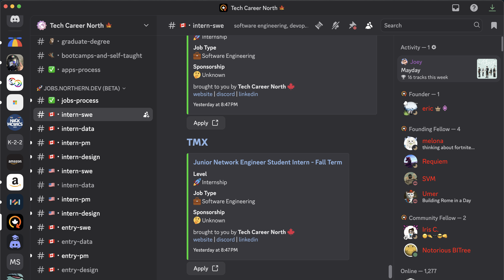
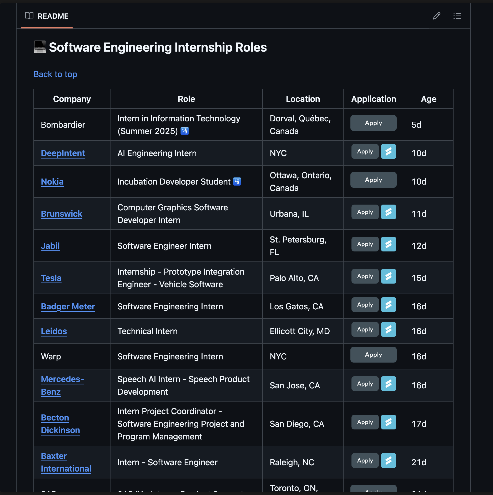

## 传统岗位搜索渠道
### Linkedin & Indeed
这两个网站就不多说了，属于最主流的求职渠道。建议每天刷一刷，根据关键词浏览岗位，每天坚持投一定数量，并持续整个招聘季。保持节奏比一开始猛投更重要，量变才能引起质变。
### 公司官方网站 
建议提前整理一份你感兴趣的公司列表，在招聘季（一般是8月中旬到10月初，或者1月到3月）期间，定期手动或通过脚本访问它们的 careers 页面，查看是否有新岗位发布。有些岗位只在公司官网上发布，不会上架到LinkedIn或第三方平台，所以不要忽视这一渠道。很多大厂（如 Jane Street、Hudson River、Jump Trading 等）就是官网优先更新。
### Career Fair
大多数学校有两次 （[例如我学校的](https://www.mcgill.ca/careers4engineers/techfair/students)），一次是秋季招聘会，一般在9-10月，也就是开学后不久；另一次是春季招聘会，一般在2月前后。去学校摆摊的，一般都是有职位要招人，而且考虑intern/new grad。和HR在career fair打好关系偶尔也能帮你直接跳过简历关。

## 隐蔽岗位搜索渠道
好吧，其实也没那么隐蔽，只是下面这几个平台不太传统，所以很多同学不知道。
### Discord servers
有些Discord Server里会有一些爬虫机器人在实时抓北美招聘新开放的岗位，推荐两个我个人用的：

- [cscareers.dev](https://discord.gg/UpVFjrzvXC) (#intern_postings)
- [Tech Career North](https://discord.gg/daKQ5WVsWT) (#intern_swe, #intern_data, ...)

	

### Github 仓库
 GitHub上有些库也会时不时更新新开发的岗位，一般是基于爬虫或者基于社区贡献，例如：

- [SimplifyJobs/Summer2025-Internships](https://github.com/SimplifyJobs/Summer2025-Internships)
- [speedyapply/2025-SWE-College-Jobs](https://github.com/speedyapply/2025-SWE-College-Jobs)

	

