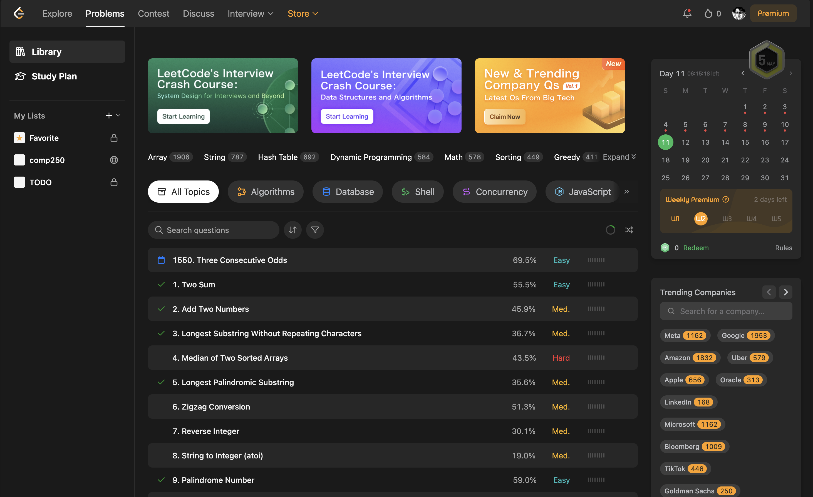
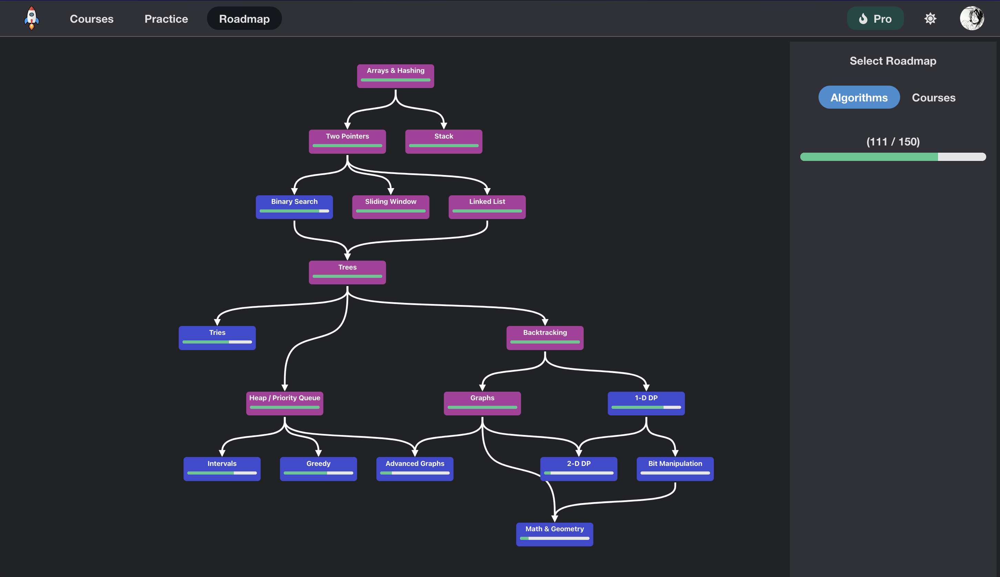
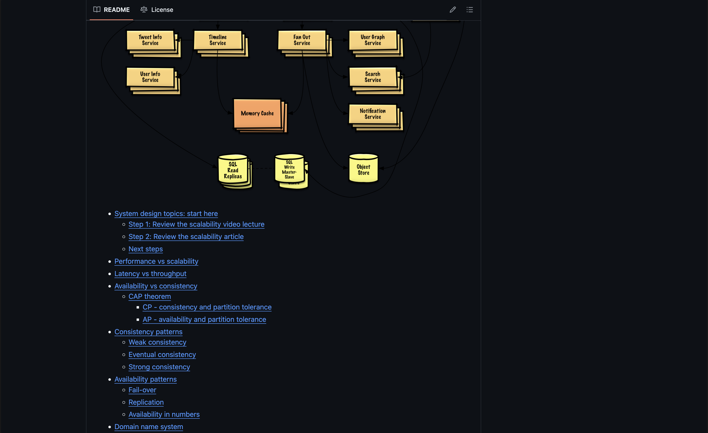
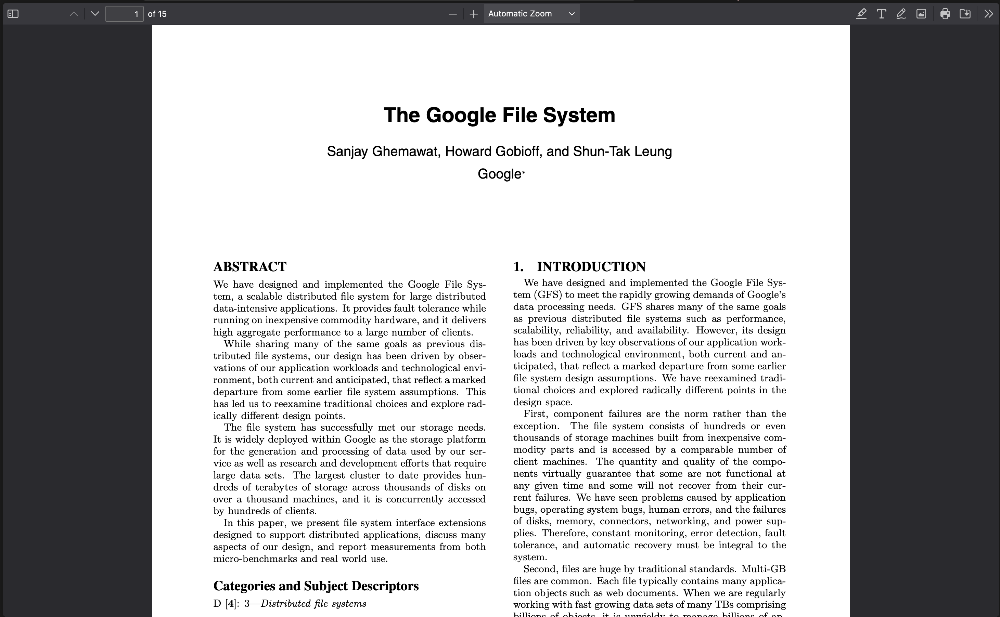

这篇章节主要整理一下提升技术方面的资源，帮助大家在面试会问的算法、数据结构和系统设计方面有所提升。

### 算法与数据结构 (DSA)
#### [LeetCode](https://leetcode.com/)
最受欢迎的算法刷题平台，题目覆盖面广，有中英文版本，包含各大公司的面试真题，建议从简单题开始循序渐进。

#### [Codeforces](https://codeforces.com/)
专业的算法竞赛平台，如果觉得LeetCode难度不够可以尝试，不过对于普通面试来说可能会过于深入。

#### [Neetcode.io]() 和 [YouTube 频道](https://www.youtube.com/c/neetcode)
该网站对LeetCode经典题目进行分类整理，并提供清晰的视频讲解，适合快速掌握特定题型的解题思路。刷题经验比较少的同学可以从这里根据他整理的经典题目开始。

### 系统设计
#### [donnemartin/system-design-primer](https://github.com/donnemartin/system-design-primer)
GitHub上的开源系统设计指南，内容全面且持续更新，从基础概念到实际应用都有涵盖。

#### [ByteByteGo](https://www.youtube.com/ByteByteGo)
知名的系统设计YouTube频道，通过精美动画讲解各种系统架构，需要注意的是其设计有时过于复杂，面试时应适度简化。

#### [Designing Data-Intensive Application](https://dataintensive.net/)
Martin Kleppmann撰写的经典著作，深入探讨了分布式系统和数据密集型应用的设计原理，从基础数据模型到复杂的分布式架构都有详细论述。需要注意的是，这本书主要聚焦在数据密集型应用的设计，而面试中并不总是考察这类场景，建议配合其他资源使用。

#### 各种工业paper和blog
我个人觉得这是一个被低估的学习资源。很多公司的技术博客和论文详细介绍了他们在解决实际问题时的架构设计，比纸上谈兵具有参考价值。例如经典的[Google File System论文](https://research.google.com/archive/gfs-sosp2003.pdf)、[MapReduce论文](https://research.google.com/archive/mapreduce-osdi04.pdf)，还有[Netflix关于Chaos Engineering的系列博客](https://netflixtechblog.com/tagged/chaos-engineering)等，这些都是学习系统设计的优质资料。

