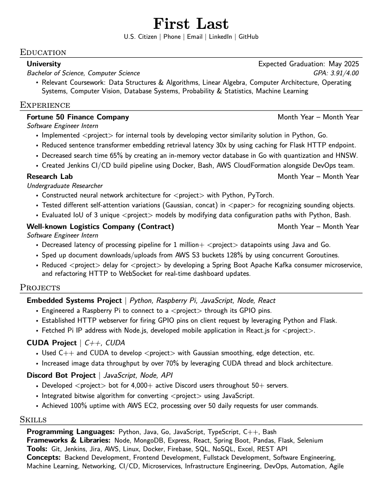
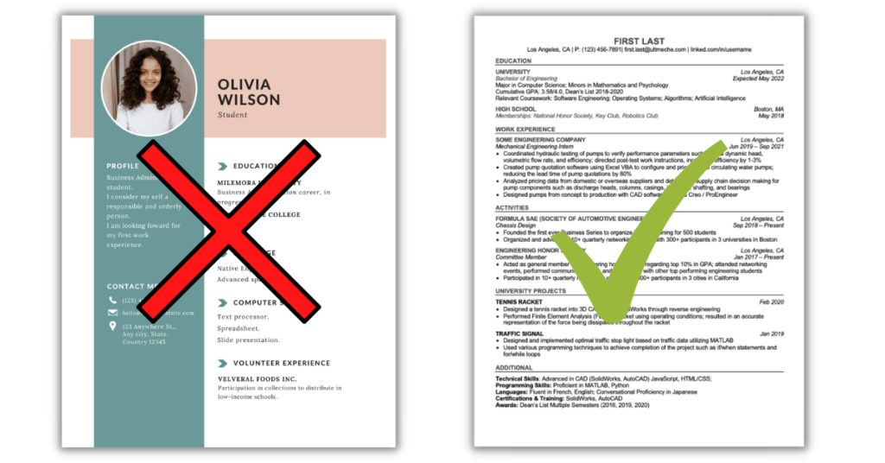

一份好的简历是你申请实习最重要的敲门砖，这篇章节会概括如何打造一份好的简历，根据自己的强项优化简历，和如何根据不同的职位定制简历。

## 了解你的客户群

你的简历本质上是一个推销工具，类似公司向投资人展示的 PPT。目标是用最短时间向**HR、工程师、招聘经理**三类不同角色精准传达你的价值。

一份简历在大多数公司的筛选流程是线性的。通常一份技术岗简历的流转顺序是：  
**HR 初筛 → 工程师技术评估 （ + 安排面试） → 招聘经理最终决策（ + 安排面试）**

因此，一份好的简历需要同时满足以下要求：

- **对 HR 友好**：关键词突出，格式清晰，快速识别你符合职位要求。
- **对工程师友好**：技术细节准确，体现解决实际问题的能力。
- **对招聘经理友好**：展示业务影响、项目成果，体现领导力或成长潜力。

当然，作为一个大学生，其实很难体现出什么特别牛的技术或者业务影响。下面几个 section 会教你如何以一个学生的角色写出一份好的简历。

先附上一个我认为写的很好的简历：

	

## 简历模版与结构

废话不多说，先放模版：
[Jake's Resume](https://www.overleaf.com/latex/templates/jakes-resume/syzfjbzwjncs)

这份简历其实有些内容写的不算完美，但是干净简洁，有非常多技术岗位的同学用这份简历求职。

一份高效简历的基本组成部分通常包括：

#### Header

姓名、联系方式、portolio (e.g. GitHub)、地理位置

#### Education

高等教育经历 (Associate's, Bachelor's, Master's, PHD) - 学校 、学位、开始时间和预计毕业时间、GPA（如果优秀的话可以展示、课程（如果和工作关系大并且简历空白位置较多可以展示）。

#### 工作/实习经历

公司名称、职位、起止时间
每条经历下列出 3-5 个点，包含工作使用的技术栈。

#### 个人项目

如果工作经验不足可以多放一些个人项目，展示自己的技术。
如果有成熟的个人项目也建议放入简历，这里成熟可以指几个不同的方面

- 解决了实际问题并且有真实用户：部署了的网站，download 多的软件，GitHub stars 多的技术型 repo 都算。
- 技术复杂，有实际学习成果的项目：手搓编译器，K8s 之类的比较高难度项目也可以

#### 技能列表

编程语言、框架、工具。主要用于 HR 或者人才库系统快速根据关键词筛选。

其他方面有成就的同学也可以考虑加入以下 sections：

#### Publications

发布过的 paper，尤其是顶刊或者和工作岗位有关的 paper 也是大加分项

#### Scholarships & Awards

如果简历比较空，可以写一些拿过的含金量比较大的奖项。

### 简历篇幅与内容优先级

你的学生简历应当快速的把以下这个重点表达出来

> 我是 XX 学校 XX 专业的学生，我预计 20XX 年毕业。我的个人经历和项目与此岗位相关，所以我可以胜任这份工作。

高竞争的实习岗位可能一个岗位就会收到上万份简历，也有研究表明过[一位 HR 看一份简历的时间平均不超过 10 秒](https://www.indeed.com/career-advice/resumes-cover-letters/how-long-do-employers-look-at-resumes)。你的简历应该遵循以下几个点

- 长度保持一页 A4/Letter 纸：HR 没有那么多时间仔细阅读每一页
- 教育经历放在简历第一位：HR 可以马上看到你是学生，并且看到你的毕业日期。有些岗位会卡毕业日期。
- 适当加粗工作/项目描述里的重要点：可以快速让 HR 看到你的技术栈和工作成果，以防亮点被忽略。

编写好简历后可以让同学或者朋友阅读一下，看看他们能不能快速的 get 到你想表达的重点。

## 撰写高效的工作描述

网上有很多不同编写工作描述的公式（STAR， CAR， 等等）。 其实这些公式的主要目的就是让你不要啰嗦和讲重点，用一句话清楚表达你解决了什么问题、怎么解决的、结果如何。

我个人习惯使用每项经历的第一个 bulletpoint 作一个负责业务的简介，然后后面的 bulletpoints 根据**问题 - 产出 - 结果**的格式编写。

### 问题 - 产出 - 结果

一句好的 bullet point 应该包含三个核心要素：**问题 – 产出 – 结果**。

以我在某后端开发实习写的一个接口为例：

> Worked on a backend endpoint to help with restarting models.

这个描述的问题在于：

- **不具体**：没说清楚是 API 具体是干啥的。
- **没有说明解决了什么问题**。
- **缺乏结果**：对业务或用户的影响完全没有体现。

> Was involved in designing and implementing a backend interface that allows users to restart multiple machine learning model deployments in a batch manner using a variety of filters, in order to improve efficiency and reduce the amount of manual work required by machine learning developers when they need to perform restarts.

这个描述的问题在于太啰嗦，占位置且不好抓重点。

而一个好的 bulletpoint 则可以是：

> Implemented an API endpoint to perform a batch rolling restart on model deployments based on a set of filters, streamlining ML developers workflow by reducing manual intervention.

一句话清楚的表达了

- **问题**: 重启流程繁琐
- **产出**: 开发一个支持过滤器的批量 rolling restart 接口
- **结果**: 减少手动操作，提升算法工程师效率

### 量化结果

很多人喜欢强调量化结果，比如

> Implemented XXX for YYY, sped up client loading time by 99%.

这种描述确实能清楚展示你对业务的直接影响，因此在有数据时建议尽可能展示。

不过也不需要过于追求“量化”。有些人认为只有写出具体数据才能体现出真正的价值，我个人对此**不完全认同**。大部分实习生并不会被分配到能直接带来业务指标提升的项目，除非你的 mentor 非常信任你、愿意让你负责一个关键项目。

很多技术岗位的工作本质上是**bug 修复、技术研究、基础设施开发、工具链建设**等，这些内容**很难精确量化**，但依然是非常有价值的工作，一位优秀的 HR 和工程师也很清楚这一点，并且反而会觉得过度量化拉低了候选人的可信度。

我有一条 bulletpoint 是：

> Led the refactor of the frontend state management framework based on **Redux**, **reducing prop drilling and unnecessary client-side rendering**, resulting in improved developer efficiency and application performance.

这个项目持续了几个月，对团队开发效率有非常显著的提升，但很难用具体数字去 benchmark。不过这从来没有阻碍我在简历筛选或面试过程中展示这段经历的影响力。

总的来说，有数据当然好，但**没有数据也可以通过清晰表达让人看到你的贡献和技术深度**。

## 针对性简历定制

投高竞争的岗位时可以适当的对提交的简历做一些优化。尤其围绕下面几个点

- 技术栈：根据岗位简介展示有关的项目。我个人会根据岗位的需求替换我的 project section 展示的项目，尽量展示和岗位有关的项目。
- 课程：根据岗位简介展示有关的课程，例如：

  - 前端开发 —— Web Dev 课程
  - 后端开发 —— 分布式系统，云计算等
  - Programming Language Tooling —— 编程语言理论，编译器设计等
  - 算法工程 —— 深度学习，强化学习，CV， NLP 等

- 毕业日期：这个比较有争议。可以根据岗位简介里写的毕业日期更改自己的简历。例如某大厂想招 2027 Spring 毕业的，但是你 2026 Fall 就毕业了，可以调整一下自己的毕业日期然后延迟毕业。

## ATS 系统兼容性注意

绝大多数公司都用 ATS（Applicant Tracking System）来筛选简历，这类系统会用算法解析你上传的简历内容，然后匹配岗位关键词。

所以你需要确保你的简历是 **机器能读懂的格式**。

**几点建议：**

- 使用标准的 PDF 格式上传，避免 Word 或 Google Docs。
- 避免使用花哨的模板、图表、图标、两栏布局等，这些东西可能会被 ATS 忽略或错误识别。
- 简历内容建议使用清晰的标题，如 "Work Experience"、"Education"，方便系统解析。

	

## 常见简历错误与避免方法

### 展示较低的 GPA

一般不建议在简历中展示较低的 GPA（例如低于 3.0）。虽然多数大型公司并不会特别在意，但如果明知成绩不理想仍主动写出来，可能会给人一种不够认真的印象。

### 描述过于抽象或技术细节错误

比如写“developed a platform using AI”过于模糊；或拼错技术名词（如“Tensorflow”写成“Tensoflow”），会给人不专业的印象。

### 模板混乱或格式不统一

比如时间对齐方式不一致、项目标题大小写混乱、字体大小不统一等。这类视觉噪音容易干扰 HR 阅读。

### 内容不够针对岗位

一份万能简历可能在任何岗位都“不够突出”。简历必须围绕目标岗位定制（项目、技术栈、课程等），尤其是你投实习数量多时。

### 冗余内容占用空间

如高中经历、与职位无关的课外活动、无关证书、工作经历等。这些内容占位置但价值低，建议删掉换成相关项目或技能。
