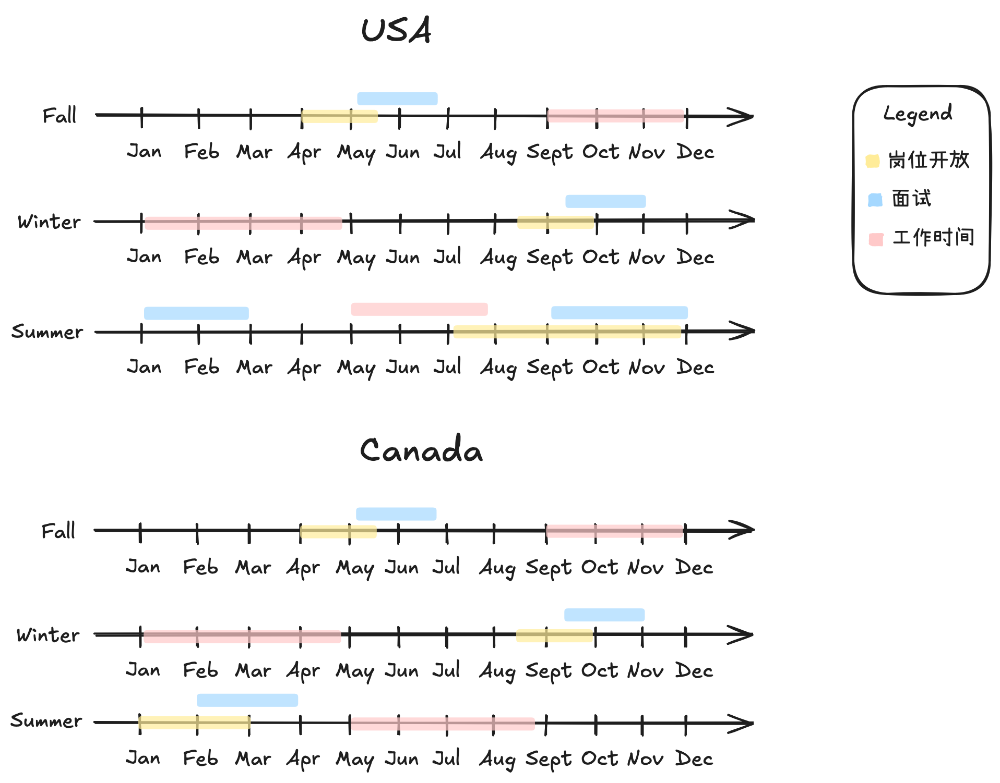

北美实习基本集中于三个时间段：Fall、Winter 和 Summer，对应学期制中的秋季学期、冬季学期和夏季学期。

每个学期的实习申请流程大致包含三个关键时间节点：**岗位开放时间**（招聘职位上线）、**面试流程时间**（包括笔试、HR 面试和技术面试等）、以及**岗位开始时间**（正式入职）。

需要注意的是，部分大公司（如 Amazon、Meta 等）可能提前数月启动夏季实习的招聘，尤其在美国市场。以下提供加拿大和美国地区的参考时间线。

	

### 美国

**Fall Term 实习（较少公司提供，通常为co-op）**

1. 岗位开放时间：4月至5月左右
2. 面试流程时间：5月至6月
3. 岗位开始时间：8月或9月

**Winter Term 实习（较少公司提供，通常为co-op）**

1. 岗位开放时间：8月至9月左右
2. 面试流程时间：9月至10月
3. 岗位开始时间：12月末或1月

**Summer Term 实习**

1. 岗位开放时间：8月至10月（部分大公司和量化公司会在8月初甚至7月末开放）
2. 面试流程时间：9月至12月
3. 岗位开始时间：次年5月至6月之间

### 加拿大

<!-- prettier-ignore -->
!!! Warning
	在加拿大驻办公室的美国公司(e.g. Amazon Vancouver, Microsoft Vancouver) 遵循美国 timeline 。这里加拿大主要指 HQ 或者大部分员工 base 加拿大的公司 (e.g. Shopify, 1Password)

**Fall Term 实习**

1. 岗位开放时间：5月左右
2. 面试流程时间：5月至6月
3. 岗位开始时间：9月

**Winter Term 实习**

1. 岗位开放时间：9月左右
2. 面试流程时间：9月至10月
3. 岗位开始时间：1月

**Summer Term 实习**

1. 岗位开放时间：1月左右
2. 面试流程时间：1月至2月
3. 岗位开始时间：5月

## 申请时间规划

保持一个良好的时间规划对于成功拿到实习机会至关重要。实习申请往往涉及大量职位信息筛选、简历修改、刷题准备和面试安排，如果没有提前布局，很容易陷入临时应付的状态，错过最佳申请时机。通过了解不同实习期的时间线，制定合理的申请节奏，并提前准备内推与推荐材料，可以显著提升命中目标岗位的机会。

#### 持续关注新的岗位

不同实习学期的岗位开放时间不同，建议根据目标学期提前1-2个月开始关注各个<a href="job_search.html">岗位搜索网站</a>。关注这些平台的职位更新可以帮助你在第一时间发现合适的岗位，避免错过最佳申请窗口。

#### 尽早申请大厂

许多大公司采用 rolling basis 筛选简历的方式，也就是说他们会一边接收申请，一边开始面试流程，直到岗位满员为止。这类岗位越早申请越有优势。例如 Amazon、Meta 等常在岗位开放后的前两周就完成了大部分面试安排。若晚于高峰期投递，简历可能根本不会被看到。

#### 提早准备推荐信和内推

如果你计划走内推或需要推荐信支持申请，务必提前准备。推荐人（如导师、前主管）通常也有繁忙日程，临时请求可能导致错过最佳时机。内推系统本身也可能有时限或配额，建议提前与朋友、校友或前实习同事沟通，确保他们有充足时间提交内推信息。

## 签证注意事项

本篇实习攻略不会详细展开签证相关的内容。对于计划申请 Fall 或 Winter 实习的同学，建议提前咨询学校的国际学生办公室或其他相关专业人士，确认自己的签证身份是否允许在对应时间段实习。确保资格合规是顺利实习的重要前提。
